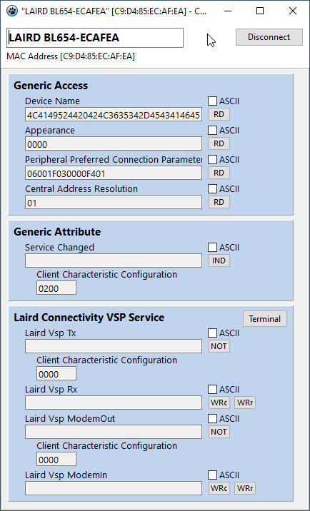

# InsideBlue BLE Tool
Welcome to **InsideBlue BLE Tool**, an easy to use cross-platform application for Bluetooth Low-Energy (BLE) connectivity leveraging the PC’s integrated Bluetooth adapter.

You can scan for BLE devices that are advertising and discover their GAP services or manufacturer specific data, engage a connection and access the peripheral GATT table.

## Main Scan Window
After start the main scan window opens and provides common controls for BLE device discovery.

### Start/Stop Scanning
Pressing the [Start Scan] button starts scanning for BLE advertisments. Discovered devices will be shown as a panel list underneath. After scanning has started, the button turns into a [Stop Scan] button and BLE scanning stops when pressed again. The [Clear] button clears the panel list of discovered devices.

### Filters
Three filters can be applied to the device scanning. Entering a device name or part of it into the left field will only show devices matching. The device name is not case-sensitive. The middle field filters for BLE mac addresses or part of it. The mac address has to be entered as hex numbers separated by colons (aa:bb:cc:dd:ee:ff). The right field allows filtering based on the RSSI value of advertisments which – to some extent – represents the distance of a device. Values have to be entered as positive numbers.

### Scan Data Panel
For each discovered device a panel with device information is shown. It contains device name, connectable status, tx power (if available), RSSI value, mac address, advertised services and manufacturer specific data.

If the UUID of a service or the company ID in the manufacturer data is in the official Bluetooth list of assigned numbers, the official name will be shown. You can hover with the mouse over the name to see the underlying service UUID or full company name with ID.

Manufacturer data can be displayed either as HEX numbers or ASCII string. For ASCII non printable characters are displayed as black boxes.
Connect Device
If a device is connectable you can engage a connection with the Connect button.

### Log Output
A more detailed log output can be enabled by ticking the Show Log Output box. The main window will extend to the right and show the log output.
Two additonal buttons allow clearing the log output as well as copying the log output into the clipboard. You can also directly select text in the log output and copy.

## Device Connect Window
When connecting to a device, a new device specific window opens and the GATT table of the device is read. Services, characteristics and descriptors are shown in a panel structure grouped by services. 

If the UUID of a service, characteristic or descriptor is in the official Bluetooth list of assigned numbers, the name will be shown. You can hover with the mouse over the name to see the underlying UUID number.

Depending on the properties of each characteristic different buttons get added to the text field. Those are Read, WriteCommand, WriteRequest, Notify and Indicate.

Data from/to a characteristic gets displayed or entered into a text field, which is either read/write or read only. You can switch the presentation between HEX numbers or ASCII string. When set to ASCII, non-printable characters are displayed as a black square.

## Limitations
- Since InsideBlue leverages the PC’s integrated Bluetooth Controller, this ultimately limits what’s achievable from a BT hardware perspective (e.g., number of simultaneous connections).
- It is not possible to tweak BLE settings like scan interval and/or scan window or similar low-level BLE parameters.
- Pairing of BLE devices is not yet implmented.
- Due to a limitation of the underlying BLE library, it’s not possible to properly receive notifications or indications from devices exposing an identcal GATT table (i.e. identical service/characteristic UUIDs).
- The underlying BLE library does not yet expose properties of the descriptors and hence it’s not yet possible to directly read/write them.

## Releases / Installation
You can download a ZIP with pre-built binaries for Windows 64 bit from the [releases tab](https://github.com/eriklins/InsideBlue-BLE-Tool/releases). 

InsideBlue BLE Tool does not require any installation. Just unzip anywhere and run. The ZIP includes the executable, two dll files and a help file.

## Building InsideBlue BLE Tool
This project is implemented with the [Lazarus IDE](https://www.lazarus-ide.org/) and [FreePascal](https://www.freepascal.org/). Lazarus is a free Delphi compatible cross-platform IDE for Rapid Application Development. Free Pascal is a mature, versatile, open source Pascal compiler.

InsideBlue BLE Tool was built with Lazarus IDE v2.3.0 (trunk) and FreePascal 3.2.2 on Windows 10 x86_64.

Since both Lazarus/FreePascal as well as the SimpleBLE library are cross-platform, Linux and Mac OS versions of InsideBlue BLE Tool should be possible. Looking into that...

## BLE Library
Inside Blue BLE Tool is based on the SimpleBLE library (https://github.com/OpenBluetoothToolbox/SimpleBLE) and uses the Pascal bindings for that library (https://github.com/eriklins/Pascal-Bindings-For-SimpleBLE-Library).

## Releases
Pre-built releases for Windows 64 bit are available on the [releases tab](https://github.com/eriklins/InsideBlue-BLE-Tool/releases).

## Contributing/Feedback
Feedback / improvements / pull-requests / etc. are welcome!

## License
Copyright (C) 2023 Erik Lins

This project is released under the MIT License.
